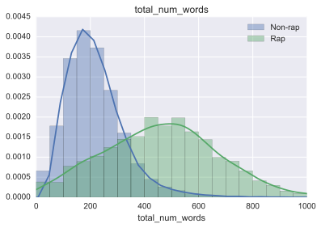

Cross-Language Rap Detector
---------------------------

For my [RapItalia project](https://github.com/drsaunders/RapItalia), I made the claim that I could identify both Italian and English rap songs in my lyrics dataset using superficial features of the lyrics such as the total number of words. 

In this project I use machine learning, with training data lyrics from the [musicXmatch Dataset](http://labrosa.ee.columbia.edu/millionsong/musixmatch), to see whether this is the case. The analysis is presented in the form of 

### [a Jupyter Notebook: detect_rap.ipynb](https://github.com/drsaunders/RapDetector/blob/master/detect_rap.ipynb)